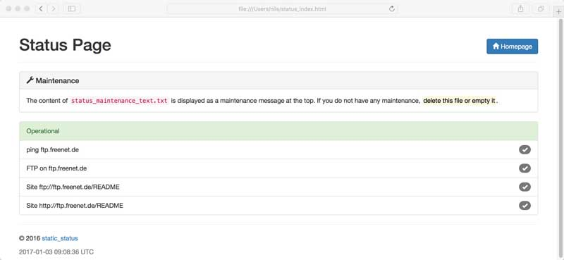
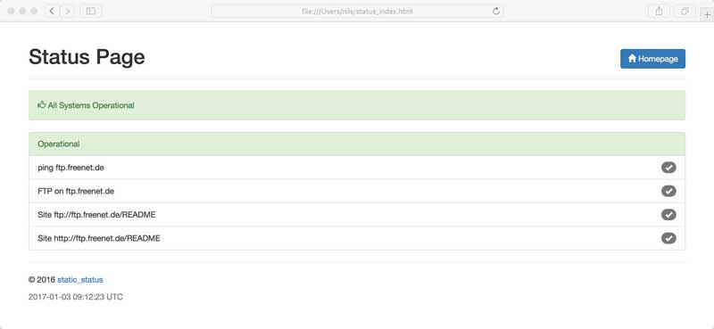
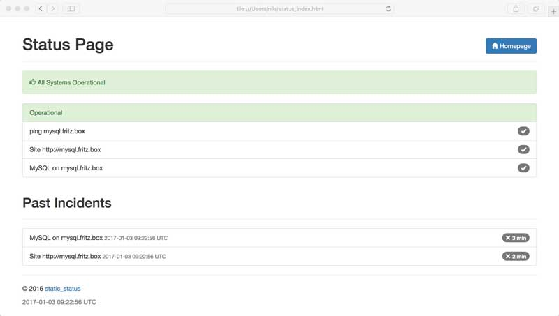
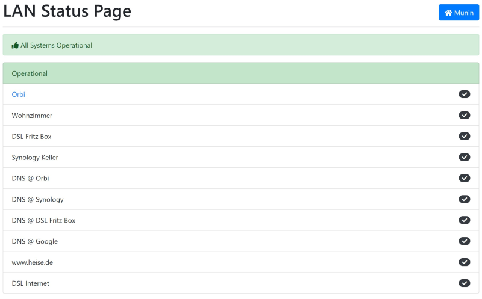

#  status.sh 🚀

[](#readme)
[](https://github.com/Cyclenerd/static_status/actions/workflows/shellcheck.yml)
[](https://github.com/Cyclenerd/static_status/actions/workflows/ubuntu_2204.yml)
[](https://github.com/Cyclenerd/static_status/blob/master/LICENSE)

##  Description 📝

Simple Bash script to generate a static status page. Displays the status of websites, services (HTTP, SAP, MySQL...), and ping. Everything is easy to customize. 🤓

You can also easily check more complicated things with this script.
For example, if a text is present on a web page or if a host appears in the route path (traceroute).
Checking the route path is useful, for instance, if you have a backup mobile internet connection in addition to your cable connection.


In addition to the status web page, there is also a JSON version and an SVG icon.
With the script `alert.sh`, you can be alerted by email, SMS or Pushover in case of a downtime.

##  Installation 📦

By default, it's a good practice to create a `status` directory within your home directory and place everything in it :
```shell
mkdir ~/status
cd ~/status
```

### 1️⃣ Download Script

Download Bash script `status.sh`:
```shell
curl -O "https://raw.githubusercontent.com/Cyclenerd/static_status/master/status.sh"
```

> 💡 Tip: Update works exactly the same way as the installation. Simply download the latest version of `status.sh`.

### 2️⃣ Download Configuration

Download configuration file `status_hostname_list.txt`:
```shell
curl -O "https://raw.githubusercontent.com/Cyclenerd/static_status/master/status_hostname_list.txt"
```

### 3️⃣ Customize

Customize the `status_hostname_list.txt` configuration file and define what you want to monitor:
```shell
vi status_hostname_list.txt
```

### Optional

Edit the script `status.sh`, or better add more configuration to the configuration file `config`.

Download the example configuration file:
```shell
curl \
  -f "https://raw.githubusercontent.com/Cyclenerd/static_status/master/config-example" \
  -o "config"
```

Customize the configuration file:
```shell
vi config
```

### Run

```shell
bash status.sh
```

## Usage 📋

```text
Usage: status.sh [OPTION]:
	OPTION is one of the following:
		 silent  no output from faulty connections to stout (default: no)
		 loud    output from successful and faulty connections to stout (default: no)
		 debug   displays all variables
		 help    displays help (this message)
```

Example:

```shell
bash status.sh loud
```

Execute a cron job every minute:

```shell
crontab -e
```

Add:

```text
*/1 * * * * bash "/path/to/status.sh" silent >> /dev/null
```

## Requirements ⚙️

Only `bash`, `ping`, `traceroute`, `curl`, `nc`, `grep` and `sed`.
In many *NIX distributions (Ubuntu, macOS) the commands are already included.
If not, the missing packages can be installed quickly.

On a debian-based system (Ubuntu), just run:

```shell
sudo apt install curl iputils-ping traceroute netcat-openbsd grep sed
```

> 💡 Tip: You can disable the `traceroute` dependency. Add `MY_TRACEROUTE_HOST=''` to your config.


## Demo 🌐

This [demo page](https://cyclenerd.github.io/static_status/) is generated with [GitHub Action](https://github.com/Cyclenerd/static_status/blob/master/.github/workflows/main.yml):
<https://cyclenerd.github.io/static_status/>

### Screenshots 📷







## Custom Text 📄

You can display a custom text instead of the HOSTNAME/IP/URL (see example below).



status_hostname_list.txt:

```text
ping;8.8.8.8|Google DNS
nc;8.8.8.8|DNS @ Google;53
curl;http://www.heise.de/ping|www.heise.de
traceroute;192.168.211.1|DSL Internet;3
script;/bin/true|always up
```

## JSON 📊

You can also create a JSON status page.
Configure the variable `MY_STATUS_JSON` with the location where the JSON file should be stored.

Example JSON:
```json
[
  {
    "site": "https://www.nkn-it.de/gibtesnicht",
    "command": "curl",
    "status": "Fail",
    "time_sec": "282",
    "updated": "2023-04-19 14:01:23 UTC"
  },
  {
    "site": "https://www.heise.de/ping",
    "command": "curl",
    "status": "OK",
    "time_sec": "0",
    "updated": "2023-04-19 14:01:23 UTC"
  }
]
```

## SVG Icon 🖼️

If you want to signal directly if everything is fine or if something is wrong in the infrastructure, you can insert the SVG icon into your website.

Please remember to include the image with a cache breaker URL (eg. an appended timestamp:
```html
<a href="status.html">Status </a>
```

Static websites need to fallback to render the icon with javascript, eg with:
```html
document.write('')
```

## Custom Script Checks 🛠️ 

You can extend the checks of `status.sh` with your own custom shell scripts.

If the shell script outputs a return code `0` it is evaluated as available.
With the special return code `80`, it is not classified as down but as degraded.
With all other return codes, it is a failure (outage, down).

Add your script to the `status_hostname_list.txt` configuration file. Example:

```text
script;script.sh
script;/path/to/your/script.sh|Custom Text
script;/path/to/your/script.sh parameterA parameterB|Custom Text
```

The script [`check-websites.sh`](./scripts/check-websites.sh) is an example.

## TODO ✅

1. **Bug Fixes and Enhancements**: Address any reported issues and consider adding new features to improve the script's functionality.

2. **Comprehensive Documentation**: Create detailed documentation covering script configuration, customization, and advanced usage.

3. **Code Cleanup**: Enhance code readability and performance for better maintainability.

4. **Security**: Review and enhance security measures to protect against vulnerabilities.


## License 📜

GNU Public License version 3.
Please feel free to fork and modify this on GitHub (<https://github.com/Cyclenerd/static_status>).
